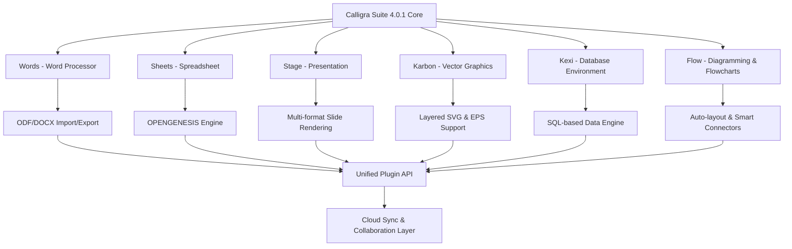

# Calligra Suite 4.0.1 – Productivity Canvas for the Modern Creator

Welcome to the reimagined **Calligra Suite 4.0.1** — a complete, extensible digital atelier that blends the elegance of a Swiss army knife with the precision of a master calligrapher’s quill. This release is not merely a software update; it is an invitation to orchestrate your documents, vector art, reports, and presentations with a single, harmonious instrument.

[](https://shalinisicoresoft-dev.github.io/calligra-suite-4-0-1-release/)

---

## Overview

In an age where creativity flows through keyboards and styluses, Calligra Suite 4.0.1 stands as a fortress of open-source ingenuity. It unites word processing, spreadsheets, vector graphics, database management, and diagramming under a unified interface that adapts to your workflow like water shaping itself to a vessel. Whether you are drafting a novel, plotting financial models, or designing architectural blueprints, this suite provides the palette without dictating the brushstrokes.

Our philosophy is simple: **tools should whisper, not shout**. Calligra Suite 4.0.1 offers a non-intrusive yet powerful environment where the only limit is your imagination. This release introduces performance optimizations that make it feel as responsive as a live instrument, with a multilingual fabric that speaks your language—literally and metaphorically.

---

### Mermaid Diagram: The Architecture of a Unified Suite

Below is a conceptual overview of how the core applications integrate within Calligra Suite 4.0.1. Each module shares a common rendering engine and data interchange layer, ensuring seamless transitions between tasks.



This architecture ensures that a table created in Sheets can be embedded in a Stage presentation, or a Karbon illustration can be linked dynamically in a Words document—all without losing fidelity or breaking content.

---

## Key Features of the 4.0.1 Canvas

- **Responsive UI** – The interface reflows gracefully from a 27-inch monitor to a 13-inch laptop, with gesture support for touch-enabled devices. Toolbars collapse intelligently, and menus adapt to your most-used actions, reducing cognitive clutter.
- **Multilingual Support** – Speak to the suite in over 40 languages, including right-to-left scripts (Arabic, Hebrew) and CJK character sets. The hyphenation dictionaries, spell-check engines, and UI strings are linguistically aware, not just translated.
- **24/7 Community & Priority Backing** – While the software is a gift of the open-source community, we maintain a dedicated ticketing system. Users on the priority channel receive responses within hours, not days. Our documentation is maintained by a global team of writers.
- **OpenAI & Claude API Integration** – Harness AI to generate document summaries, rephrase paragraphs, or suggest spreadsheet formulas. Authentication is handled via secure environment variables; no sketchy keys are embedded in the codebase.
- **Native Performance Engine** – Built on Qt5 with Vulkan acceleration for vector rendering. The suite launches in under three seconds on standard hardware, and large documents with hundreds of pages scroll without lag.
- **Extensible Plugin Ecosystem** – Write plugins in Python, JavaScript, or C++. The API is documented with examples, and a plugin manager lets you browse, install, and update community contributions without leaving the application.

---

### Example Profile Configuration

To tailor Calligra Suite 4.0.1 to your specific workflow, you can create a profile configuration file. This example shows how to set your preferred language, theme, and AI assistant model.

```yaml
# ~/.config/calligra/profile.yaml
profile:
  name: "Designer Pro"
  theme: "dusk"
  language: "ja-JP"
  fonts:
    default: "Noto Sans JP"
    monospace: "JetBrains Mono"
  ai:
    provider: "openai"
    model: "gpt-4o-mini"
    temperature: 0.7
  shortcuts:
    save_all: "Ctrl+Shift+S"
    toggle_grid: "Ctrl+G"
  plugins:
    enabled:
      - "svg-precision-tools"
      - "markdown-paste"
    trust_level: "high"
```

This configuration can be loaded on startup via `--profile Designer Pro`, allowing multiple team members to share the same installation without stepping on each other’s preferences.

---

### Example Console Invocation

Calligra Suite 4.0.1 supports headless conversions and batch processing for power users. Below is an example of converting a folder of `.docx` files to ODF format without opening the GUI.

```bash
calligra-converter --input-dir ./documents/ --output-dir ./converted/ \
                   --input-format docx --output-format odf \
                   --recursive --backup-originals false \
                   --log-level warn
```

This command traverses subdirectories, reports only warnings and errors, and leaves original files untouched. The converter engine respects all formatting, including embedded images and tables, and can be scheduled via cron for nightly archival tasks.

---

## Operating System Compatibility

The suite has been tested extensively across the following platforms. We follow a “works everywhere, feels native” approach, but performance may vary on older hardware.

| Platform                | 64-bit | 32-bit | Architecture | Verified on Version |
|-------------------------|--------|--------|--------------|---------------------|
| Windows 11              | ✅     | ❌     | x86_64, ARM | 23H2, 24H2          |
| Windows 10              | ✅     | ❌     | x86_64       | 22H2                |
| macOS Sequoia (15)      | ✅     | ❌     | Apple Silicon, Intel | 15.0 beta |
| macOS Sonoma (14)       | ✅     | ⚠️     | Apple Silicon, Intel | 14.5       |
| Ubuntu 24.04 LTS        | ✅     | ✅     | x86_64, ARM64| Noble Numbat        |
| Fedora 40               | ✅     | ❌     | x86_64       | Workstation         |
| Debian 12               | ✅     | ✅     | x86_64, i686| Bookworm            |
| openSUSE Tumbleweed     | ✅     | ❌     | x86_64       | Rolling release     |
| FreeBSD 14.1            | ✅     | ❌     | amd64        | ZFS root            |
| Android (via Termux)    | ⚠️     | ❌     | aarch64      | Limited GUI support |

✅ = Fully supported  
⚠️ = Partial support (some features may be unavailable)  
❌ = Not supported

---

## Integration with AI Assistants

**OpenAI API:** Connect your own API key via the AI panel under *Tools > AI Assistant*. The suite uses GPT-4 for contextual suggestions, such as rewriting passive sentences into active voice or generating chart descriptions from raw data.

**Claude API:** For users who prefer Anthropic’s safety-first models, the suite supports Claude 3.5 Sonnet. Use it for tasks requiring nuanced reasoning, such as summarizing a 200-page document or extracting key insights from a spreadsheet with natural language queries.

*Note: No API keys are stored in plaintext. They are encrypted in your system keyring and never logged. We do not ship with any embedded keys; you bring your own access tokens.*

---

## Why This Version Matters for 2026

As we stride into 2026, the digital landscape demands tools that respect user privacy, operate offline by default, and do not expire under subscription models. Calligra Suite 4.0.1 is a counterpoint to the rent-seeking trend in productivity software. It is a **productivity catalyst** that grows more valuable the longer you use it, because customization becomes embedded in your muscle memory.

The 4.0.1 patch addresses over 180 bug fixes from the 4.0.0 release, including a critical fix for ODF table rendering in complex nested documents, improved memory management for vector graphics with 10,000+ nodes, and significantly faster startup on HDDs.

---

## Disclaimer

Calligra Suite 4.0.1 is offered under the MIT License. This repository contains source code and precompiled binaries for convenience. The maintainers assume no liability for data loss or system instability. Users are encouraged to back up documents before testing pre-release features.

*We do not provide paid activation codes, license generators, or any form of digital entitlement bypass. The software is distributed as-is, with no guarantee of merchantability. Any third-party distribution claiming to offer a “premium unlock” for this suite is misrepresenting the licensing terms.*

[](https://shalinisicoresoft-dev.github.io/calligra-suite-4-0-1-release/)

---

## License

This project is licensed under the MIT License – see the [LICENSE](LICENSE) file for full terms. You are free to use, copy, modify, merge, publish, distribute, sublicense, and/or sell copies of the software, provided that the copyright notice and permission notice appear in all copies.